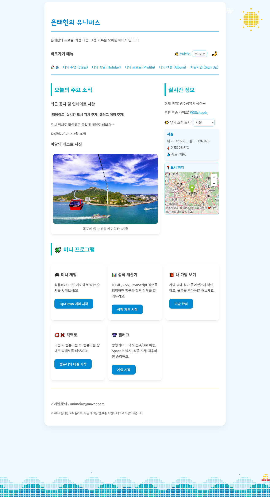
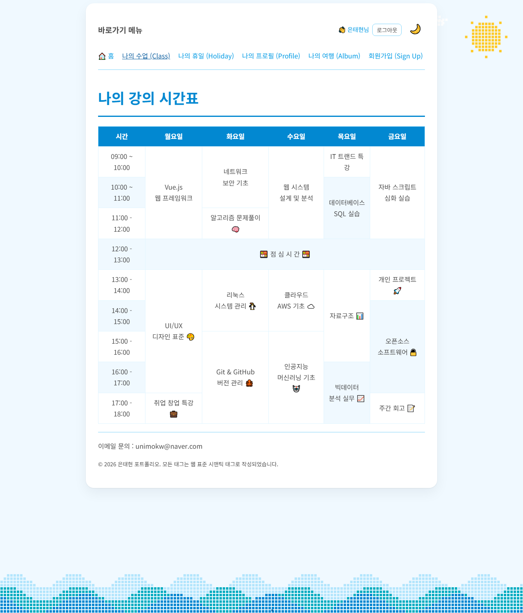
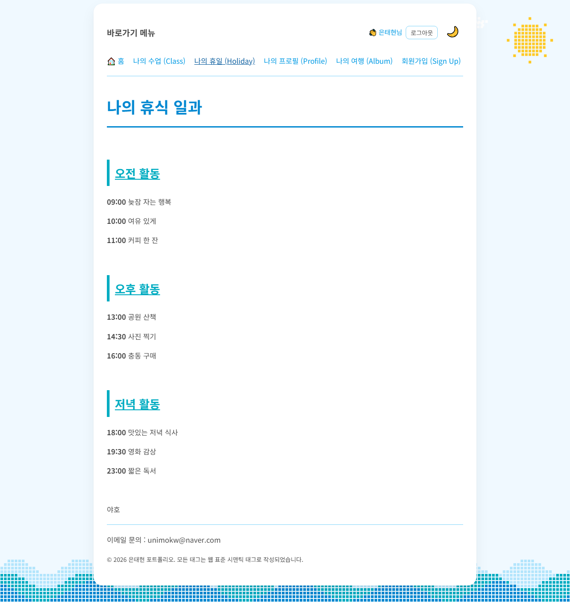
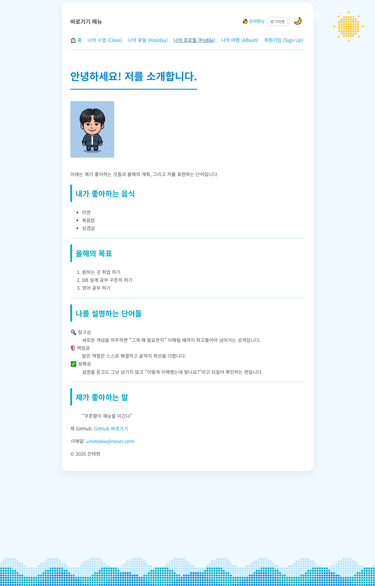
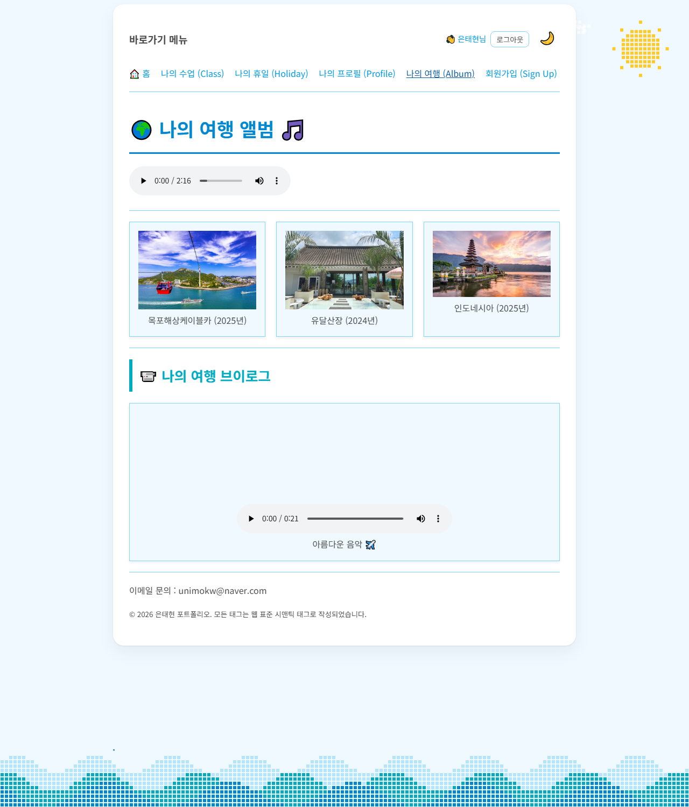
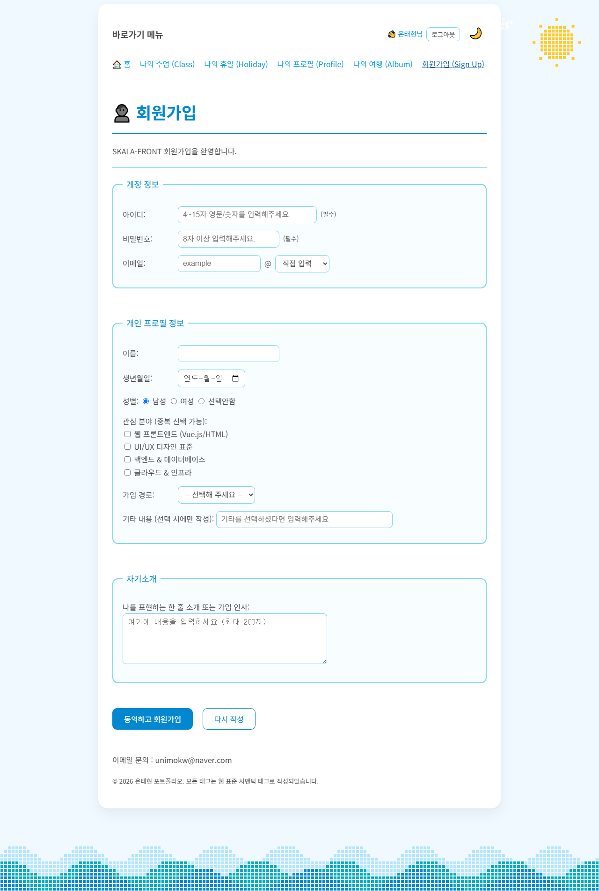
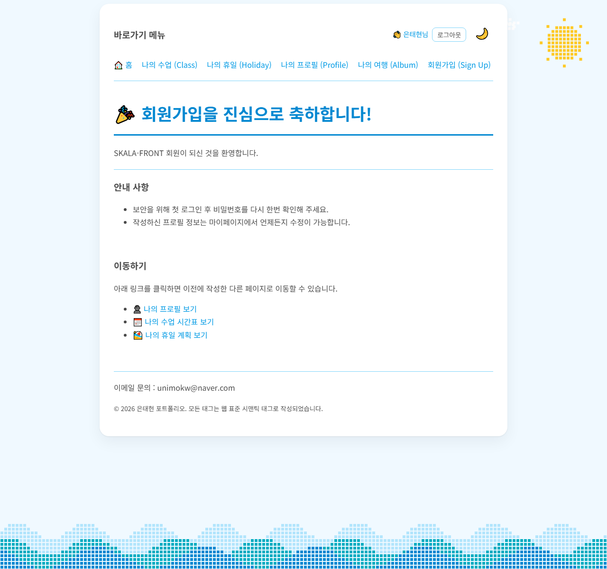
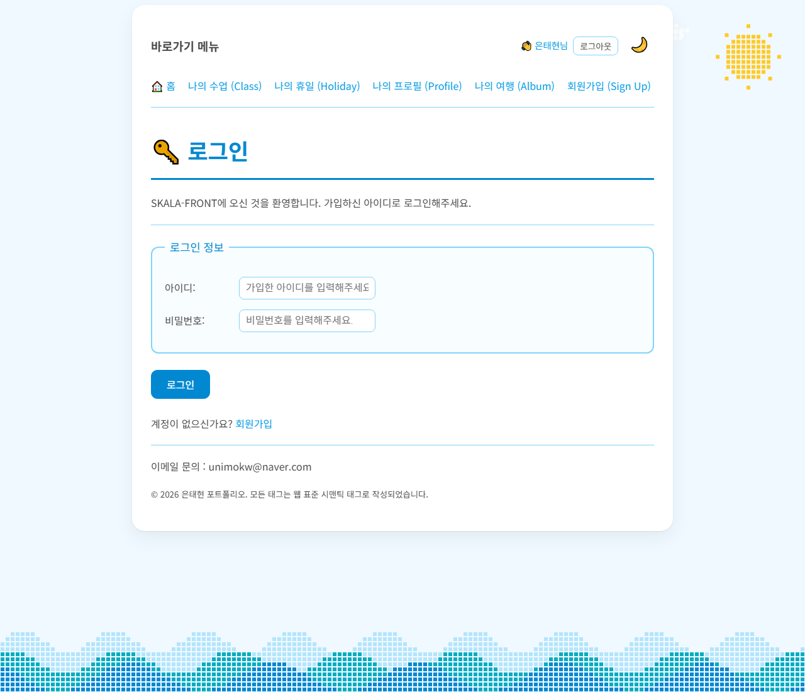
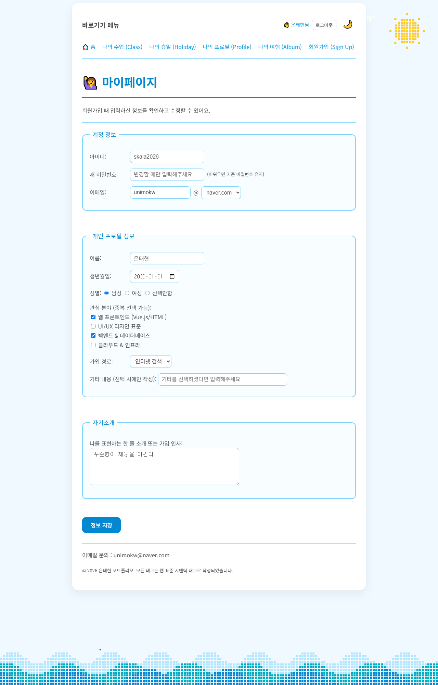
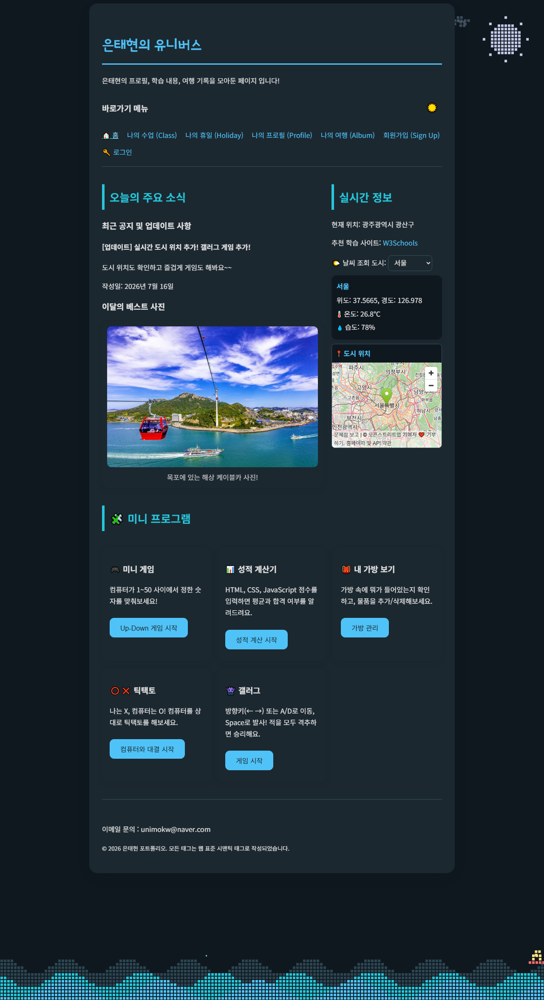

# 🪐 은태현의 유니버스 (SKALA-FRONT)

**HTML / CSS / JavaScript만으로 만든 개인 포트폴리오 웹사이트**입니다.
프레임워크·빌드 도구·백엔드 없이, SKALA 교육과정에서 배운 내용을 하루하루 실습하며 쌓아 올린 결과물입니다.

- 프로필 / 시간표 / 여행 앨범 같은 **개인 소개 페이지**
- 회원가입 → 로그인 → 마이페이지로 이어지는 **localStorage 기반 회원 기능**
- 실시간 날씨 API, 미니 게임 5종, 도트 애니메이션 배경 등 **동적 기능**


## 🔗 바로 보기 (Live Demo)

**https://taeyum.github.io/skala-front/**

GitHub Pages로 배포되어 있어 설치 없이 위 주소로 바로 접속하면 됩니다.

<details>
<summary>로컬에서 직접 실행하려면</summary>

```bash
git clone https://github.com/Taeyum/skala-front.git
cd skala-front
python -m http.server 8765
# → http://localhost:8765 접속
```

`html/index.html` 파일을 브라우저로 바로 열어도 되지만, file:// 경로에서는 브라우저 모듈 보안 정책 때문에 실시간 날씨 위젯만 동작하지 않을 수 있습니다.

</details>

## 기술 스택

| 구분 | 내용 |
|---|---|
| 마크업 | HTML5 시맨틱 태그 (`header`, `nav`, `main`, `section`, `figure` 등) |
| 스타일 | 순수 CSS — CSS 변수, Flexbox, Grid, 미디어쿼리(반응형), 애니메이션 |
| 동작 | 순수 JavaScript (Vanilla JS) — DOM 조작, 이벤트, fetch, Canvas, localStorage |
| 외부 API | [Open-Meteo](https://open-meteo.com/) (실시간 날씨), OpenStreetMap (지도 임베드) |

## 페이지 소개

모든 페이지는 공통으로 **바로가기 내비게이션 / 로그인 상태 표시 / 다크모드 토글 / 도트 애니메이션 배경 / footer**를 갖고 있습니다.

### 🏠 메인 페이지 — `html/index.html`

사이트의 관문이자 동적 기능이 모두 모여있는 페이지입니다.

- **실시간 정보**: 도시를 선택하면 Open-Meteo API로 현재 온도/습도를 비동기 조회하고, OpenStreetMap 지도에 위치를 표시
- **미니 프로그램 5종**: Up-Down 숫자 맞추기, 성적 계산기, 가방 관리, 틱택토(승리/차단 우선순위 AI 내장), 갤러그(Canvas 게임, 팝업 모달로 실행)
- 공지 게시글, 이달의 베스트 사진



### 📅 나의 수업 — `html/myClass.html`

일주일 강의 시간표를 `table`로 구현한 페이지입니다.
`rowspan` / `colspan`으로 연강·점심시간 같은 병합 셀을 표현하는 것이 핵심이고, 줄무늬(zebra) 효과와 행 hover 강조로 가독성을 높였습니다. 모바일에서는 표가 좌우 스크롤로 전환됩니다.



### 🏖️ 나의 휴일 — `html/myHoliday.html`

휴일 하루 일과를 시간대별(오전/오후/저녁)로 정리한 페이지입니다.
제목/문단/강조(`b`, `u`) 같은 **HTML 기초 텍스트 태그** 연습을 목적으로 만든, 사이트에서 가장 단순한 페이지입니다.



### 👤 나의 프로필 — `html/myProfile.html`

자기소개 페이지입니다. **시맨틱 태그를 "왜" 쓰는지**를 연습한 페이지로, 좋아하는 것(`ul`), 올해 목표(`ol`), 나를 설명하는 단어(`dl`/`dt`/`dd`), 좋아하는 문구(`blockquote`)처럼 내용의 의미에 맞는 태그를 골라 썼습니다. 소스 코드 주석에 학습하며 정리한 Q&A가 남아있습니다.



### 🌍 나의 여행 — `html/myTrip.html`

여행 사진 앨범 페이지입니다.
사진 카드 3장을 **CSS Grid** 3열로 배치하고(모바일에서는 1열), `audio` / `video` 태그로 배경 음악과 여행 브이로그를 넣었습니다. 카드에 마우스를 올리면 떠오르는 hover 애니메이션이 적용되어 있습니다.



### ✍️ 회원가입 — `html/signUp.html`

HTML 폼 요소를 총집합한 페이지입니다.
`fieldset`/`legend` 그룹, 텍스트/비밀번호/날짜 입력, 라디오(성별), 체크박스(관심 분야), 셀렉트(이메일 도메인, 가입 경로), `textarea`(자기소개), `required`·`minlength` 같은 브라우저 기본 검증까지 사용했습니다.

가입 버튼을 누르면 입력 정보가 **localStorage에 회원 목록으로 저장**되고, 자동 로그인된 상태로 완료 페이지로 이동합니다. 이미 있는 아이디면 가입이 차단됩니다.



### 🎉 회원가입 완료 — `html/signUpResult.html`

가입 완료 안내 페이지입니다. 폼의 `action`으로 연결되는 결과 페이지 개념을 연습했고, 다른 페이지로 이동하는 링크 목록을 제공합니다.



### 🔑 로그인 — `html/login.html`

가입한 아이디/비밀번호로 로그인하는 페이지입니다.
localStorage의 회원 목록과 대조해서 성공하면 메인으로 이동하고, 실패하면 에러 문구를 보여줍니다. 로그인 상태는 localStorage에 저장되어 **브라우저를 껐다 켜도 유지**되며, 모든 페이지 상단에 "👋 OOO님 + 로그아웃 버튼"으로 표시됩니다.

> ⚠️ 서버 없이 만든 학습용 인증이라 비밀번호가 브라우저에 평문 저장됩니다. 실제 서비스 방식이 아닌, 로그인 "흐름"을 구현해보는 것이 목적입니다.



### 🙋 마이페이지 — `html/myPage.html`

로그인한 사용자가 **회원가입 때 입력한 정보를 그대로 확인하고 수정**하는 페이지입니다.

- 내비게이션의 "👋 이름님"을 클릭하면 진입
- 가입 정보(이메일, 생년월일, 성별, 관심 분야, 자기소개 등)가 폼에 미리 채워짐
- 수정 후 저장하면 localStorage에 반영되고, 이름을 바꾸면 상단 인사말도 즉시 갱신
- 비밀번호는 입력했을 때만 변경 (비워두면 기존 값 유지)
- 비로그인 상태로 접근하면 로그인 페이지로 자동 이동 (접근 가드)



## 공통 기능

### 🌊 도트 애니메이션 배경 — `script/waveBackground.js`

모든 페이지 뒤에 깔리는 **Canvas 도트(픽셀) 아트 배경**입니다. 스크롤해도 화면에 고정됩니다.

- 3겹으로 출렁이는 파도 + 떠오르는 거품
- 파도를 타고 오른쪽에서 왼쪽으로 이동하는 서퍼 (노란 옷 + 빨간 보드, 파도 표면 높이를 실시간 계산해서 올라탐)
- 하늘의 해(라이트 모드)/달(다크 모드), 흘러가는 구름
- 가끔 공중제비(360° 루프)를 도는 프로펠러 비행기
- `prefers-reduced-motion` 설정 시 애니메이션 정지 (접근성)

### 🌙 라이트/다크 모드 — `script/themeToggle.js`

우측 상단 🌙/☀️ 버튼으로 전환합니다. CSS 변수 팔레트만 교체하는 방식이라 모든 페이지·모든 요소(도트 배경 색상 포함)가 한 번에 바뀌며, 선택은 localStorage에 저장되어 유지됩니다. 시스템 다크모드 설정도 자동 감지합니다.



### 👋 로그인 상태 표시 — `script/auth.js`

회원가입/로그인/로그아웃/마이페이지 로직이 모두 이 파일 하나에 있습니다. 모든 페이지가 같은 스크립트를 공유하므로, 어느 페이지에서든 로그인 상태가 일관되게 표시됩니다.

## 폴더 구조

```
skala-front/
├── html/          # 페이지 9개 (index, myClass, myHoliday, myProfile,
│                  #   myTrip, signUp, signUpResult, login, myPage)
├── css/
│   └── style.css  # 전체 스타일 (CSS 변수, 반응형, 다크모드, 애니메이션)
├── script/
│   ├── auth.js            # 회원가입/로그인/마이페이지 (localStorage)
│   ├── themeToggle.js     # 라이트/다크 모드 토글
│   ├── waveBackground.js  # 도트 파도/하늘 배경 애니메이션 (Canvas)
│   ├── realtimeInfo.js    # 실시간 날씨 UI + 지도 (ES 모듈)
│   ├── weatherAPI.js      # Open-Meteo API 호출 모듈
│   ├── upDown.js          # 숫자 맞추기 게임
│   ├── grade.js           # 성적 계산기
│   ├── bag.js             # 가방 관리
│   ├── ticTacToe.js       # 틱택토 (컴퓨터 AI)
│   └── galaga.js          # 갤러그 (Canvas 게임)
├── media/         # 사진, 음악, 영상
└── screenshots/   # README용 스크린샷
```

## 학습 여정

커밋 히스토리가 곧 학습 순서입니다.

1. **HTML 기초** — 페이지 뼈대와 시맨틱 태그 (0715 오전)
2. **폼과 미디어** — 회원가입 폼, 이미지/오디오/비디오 (0715 오후)
3. **CSS 미션 1~6** — 텍스트 스타일링 → 박스 모델 → 폼 꾸미기 → Flex/Grid → 반응형 → 애니메이션 (0715~0716)
4. **JavaScript** — 미니 게임 → DOM/이벤트 → 비동기 API 호출 → 모듈 분리 (0716)
5. **종합 응용** — 다크모드, 갤러그, localStorage 회원 기능, Canvas 배경 (0716~0718)

---

📮 문의: unimokw@naver.com · [GitHub @Taeyum](https://github.com/Taeyum)
